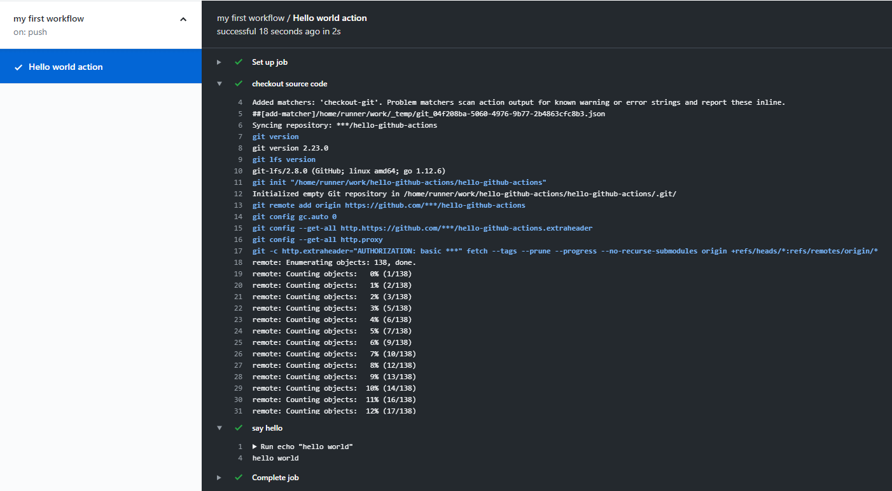

# Github Actions 사용법

## 개념

##### Workflow
소스코드를 내려받고 빌드를 하고 최종적으로 빌드 결과물을 저장하거나 배포하는 등 자동화된 전체 프로세스를 나타낸 순서도입니다. GitHub에게 나만의 동작을 정의한 workflow file를 만들어 전달하면 GitHub Actions이 그것을 보고 그대로 실행 시켜줍니다.

##### Job
잡은 여러 step을 그룹 지어주는 역할을 하며 단일한 가상 환경을 제공해 줍니다. 각 잡에 서로 다른 가상 환경을 부여할 수 있고 잡끼리의 디펜던시를 설정하거나 병렬로 실행할 수 있는 기능을 제공합니다.

##### Step
step은 Job안에서 sequential하게 실행되는 프로세스 단위이며 파일시스템을 통하여 서로 정보를 공유할 수 있습니다. step에서 명령을 내리거나 action을 실행할 수 있습니다.

##### Action
step에서는 단순히 OS에서 지원하는 명령을 내리는 것 뿐만 아니라 미리 제공된 action 혹은 사용자가 직접 customizing한 action을 호출할 수 있는 매커니즘을 제공하고 이를 action이라 부릅니다. action은 내부적으로 도커 컨테이너 혹은 javascript를 통해서 실행되며 도커를 사용할 경우 사용자는 Dockerfile을 제공함으로써 action을 커스텀화할 수 있습니다.

##### Event
정의한 workflow를 언제 실행 시킬지 알려줍니다. 기본적으로 cron잡과 같이 시간 based로 실행시킬 수도 있으며 보통 많이 사용하듯이 push, PR 등 소스코드 레포지토리의 이벤트를 기준으로 실행시킬 수 있습니다.

## `main.yml` 만들기

```yaml
# .github/
#      workflows/
#              main.yml
name: my first workflow              # workflow 이름
on: push                             # event trigger on push

jobs:
  build:                             # job id
    name: Hello world action         # job 이름
    runs-on: ubuntu-latest           # 가상 환경
    steps:
    - name: checkout source code     # step 01 이름
      uses: actions/checkout@master  # 소스코드 checkout
    - name: say hello                # step 02 이름
      run: echo "hello world"        # linux command 실행
```

```bash
git add .github/workflows/main.yml
git commit -m "my first actions workflow"
git push origin master
```





## 나만의 action 만들기

- `hello-github-actions` 라는 github 퍼블릭 레포지토리 하나 생성
- 해당 레포지토리 clone

```bash
git clone https://github.com/$USERNAME/hello-github-actions.git
cd hello-github-actions
```

총 3개 파일을 생성

- `entrypoint.sh`: 실제 실행되는 코드
- `Dockerfile`: action을 만들기 위한 도커 이미지
- `action.yml`: action 명세를 정의


- `entrypoint.sh`

```bash
#!/bin/sh -l

who=${1:-world}
echo "Hello" $who
```

- `Dockerfile`

```bash
FROM alpine:3.10

COPY entrypoint.sh /entrypoint.sh

ENTRYPOINT [ "/entrypoint.sh" ]
```


- `a`

```yaml
name: 'Hello World'               # action 이름
description: 'Greet someone'      # 간단한 설명
inputs:
  who-to-greet:                   # id of input    
    description: 'Who to greet'
    required: true
    default: 'World'
runs:
  using: 'docker'                 # 도커 사용 명시
  image: 'Dockerfile'             # Dockerfile을 이용하여 이미지 생성
  args:                           # docker run 에서 넘길 파라미터
    - ${{ inputs.who-to-greet }}
```


```bash
git add .
git commit -m "Testing my first GitHub Action"
git push origin master
```


원래 사용했던 `main.yml` 파일에 해당 action 참조

```yaml
# .github/
#      workflows/
#              main.yml
name: my first workflow              # workflow 이름
on: push                             # event trigger on push

jobs:
  build:                             # job id
    name: Hello world action         # job 이름
    runs-on: ubuntu-latest           # 가상 환경
    steps:
    - name: checkout source code     # step 01 이름
      uses: actions/checkout@master  # 소스코드 checkout
    - name: say hello                # step 02 이름
      run: echo "hello world"        # linux command 실행
    - name: Hello world action step  # 나만의 action
      id: hello
      uses: $USERNAME/hello-github-actions@master
      with:
        who-to-greet: 'Mona the Octocat'
```

